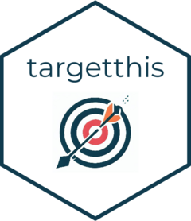
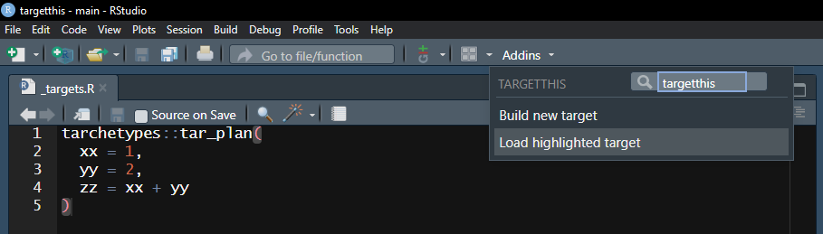
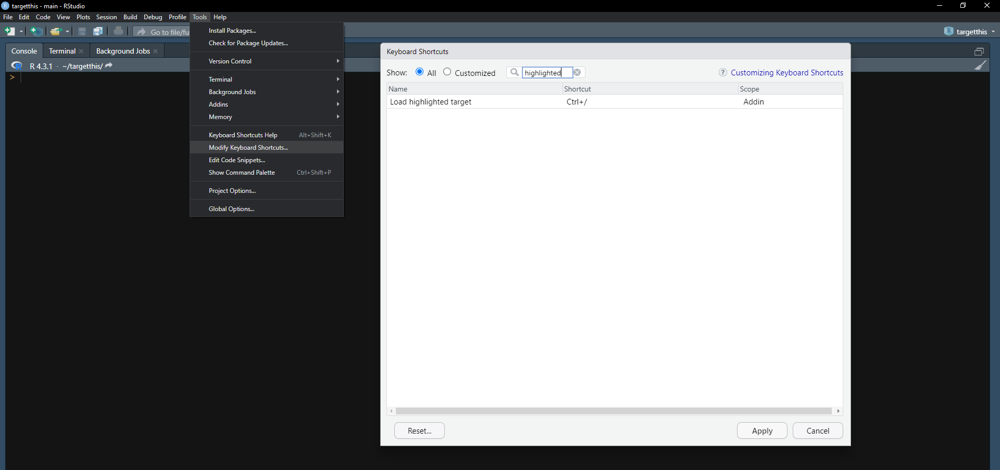

<!-- README.md is generated from README.Rmd. Please edit that file -->

```{r, include = FALSE}
knitr::opts_chunk$set(
  collapse = TRUE,
  comment = "#>",
  fig.path = "man/figures/README-",
  out.width = "100%"
)
```

# targetthis 

<!-- badges: start -->
<!-- badges: end -->

The `targetthis` package extends RStudio to assist in building and documenting `targets` pipelines. The `targets` package is documented in [The {targets} R package user manual](https://books.ropensci.org/targets/)

## Installation

You can install the development version of `targetthis` from [GitHub](https://github.com/) with:

``` r
# install.packages("devtools")
devtools::install_github("PatrickCoyle/targetthis")
```

## Feature 1: Shiny gadget to build a new target from available inputs

  

## Feature 2: RStudio addin to load a highlighted target into the global environment

 

It is recommended to bind this addin to a [keyboard
shortcut](https://support.posit.co/hc/en-us/articles/206382178-Customizing-Keyboard-Shortcuts-in-the-RStudio-IDE).

 

## References
